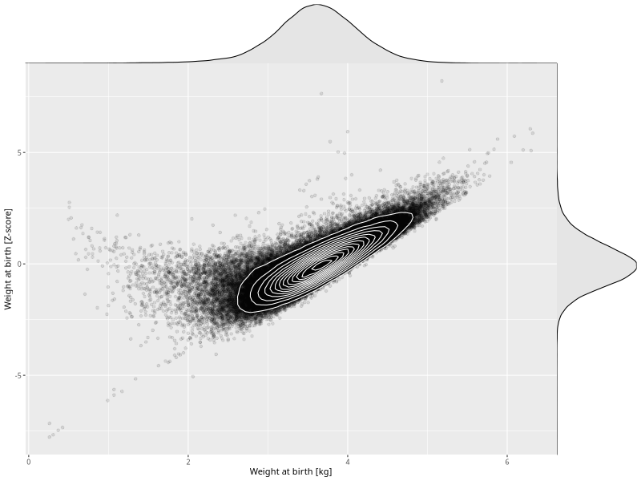

## Weight at birth

| Name | # Children | # Mothers | # Fathers | # Total |
| ---- | ---------- | --------- | --------- | ------- |
| weight_birth | 80847 | 76069 | 53195 | 210111 |
| z_weight_birth | 80847 | 76069 | 53195 | 210111 |

- Formula: `weight_birth ~ fp(pregnancy_duration_1)`
- Sigma formula: ` ~ pregnancy_duration_1`
- Distribution: `NO`
- Normalization: `centiles.pred` Z-scores

