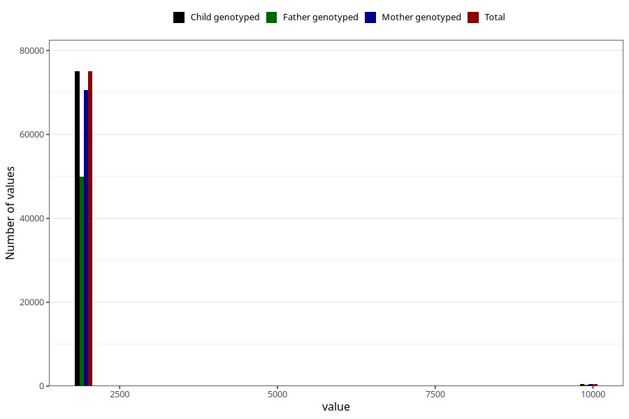

# q1_year_filled
Variable mapping to `AA11` in `Skjema1_v12`.
- Number of values:

| Value | Total | Child genotyped | Mother genotyped | Father genotyped |
| ----- | ----- | --------------- | ---------------- | ---------------- |
| Missing | 5543 | 5543 | 5169 | 3149 |
| Non-missing | 75480 | 75480 | 71060 | 50162 |
| 1999 | 566 | 566 | 543 | 100 |
| 2000 | 1946 | 1946 | 1880 | 499 |
| 2001 | 4293 | 4293 | 4157 | 1795 |
| 2002 | 7659 | 7659 | 7240 | 4780 |
| 2003 | 9534 | 9534 | 8985 | 6382 |
| 2004 | 10297 | 10297 | 9679 | 7196 |
| 2005 | 12340 | 12340 | 11517 | 8822 |
| 2006 | 10948 | 10948 | 10238 | 7906 |
| 2007 | 10617 | 10617 | 9954 | 7413 |
| 2008 | 6770 | 6770 | 6381 | 4937 |
| 2009 | 65 | 65 | 63 | 48 |
| 2044 | 1 | 1 | 1 | 0 |
| 9999 | 444 | 444 | 422 | 284 |

