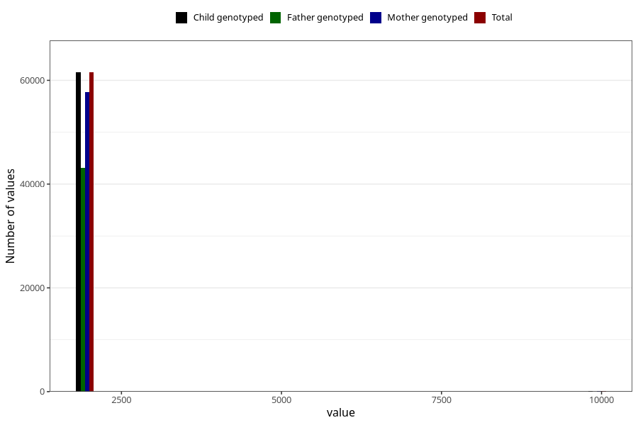

# q2_year_filled
Variable mapping to `BB11` in `Skjema2CDW_v12`.
- Number of values:

| Value | Total | Child genotyped | Mother genotyped | Father genotyped |
| ----- | ----- | --------------- | ---------------- | ---------------- |
| Missing | 19413 | 19413 | 18360 | 10182 |
| Non-missing | 61610 | 61610 | 57869 | 43129 |
| 2000 | 2 | 2 | 2 | 1 |
| 2001 | 51 | 51 | 47 | 34 |
| 2002 | 5997 | 5997 | 5658 | 3835 |
| 2003 | 8775 | 8775 | 8271 | 5880 |
| 2004 | 8717 | 8717 | 8200 | 6092 |
| 2005 | 10865 | 10865 | 10147 | 7784 |
| 2006 | 10373 | 10373 | 9757 | 7542 |
| 2007 | 9435 | 9435 | 8808 | 6562 |
| 2008 | 6811 | 6811 | 6427 | 4992 |
| 2009 | 509 | 509 | 480 | 360 |
| 9999 | 75 | 75 | 72 | 47 |

