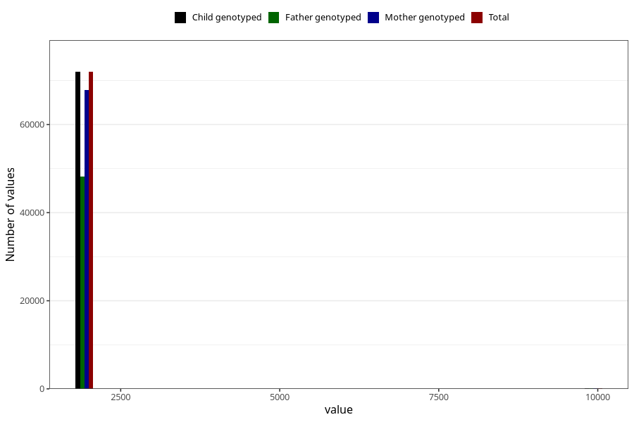

# q3_year_filled
Variable mapping to `CC11` in `Skjema3_v12`.
- Number of values:

| Value | Total | Child genotyped | Mother genotyped | Father genotyped |
| ----- | ----- | --------------- | ---------------- | ---------------- |
| Missing | 8967 | 8967 | 8335 | 5075 |
| Non-missing | 72056 | 72056 | 67894 | 48236 |
| 2000 | 1196 | 1196 | 1159 | 247 |
| 2001 | 3484 | 3484 | 3374 | 1313 |
| 2002 | 6692 | 6692 | 6364 | 3952 |
| 2003 | 9096 | 9096 | 8594 | 5986 |
| 2004 | 10136 | 10136 | 9552 | 7101 |
| 2005 | 11074 | 11074 | 10334 | 7919 |
| 2006 | 10960 | 10960 | 10298 | 7985 |
| 2007 | 10157 | 10157 | 9455 | 7038 |
| 2008 | 7929 | 7929 | 7519 | 5736 |
| 2009 | 1232 | 1232 | 1151 | 897 |
| 9999 | 100 | 100 | 94 | 62 |

