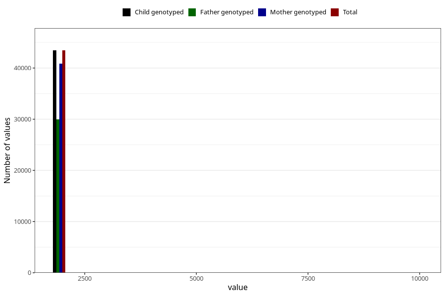

# q3y_year_filled
Variable mapping to `GG11` in `Skjema6_3aar_v12`.
- Number of values:

| Value | Total | Child genotyped | Mother genotyped | Father genotyped |
| ----- | ----- | --------------- | ---------------- | ---------------- |
| Missing | 37569 | 37569 | 35357 | 23364 |
| Non-missing | 43454 | 43454 | 40872 | 29947 |
| 2001 | 5 | 5 | 3 | 2 |
| 2002 | 16 | 16 | 15 | 10 |
| 2003 | 17 | 17 | 17 | 11 |
| 2004 | 820 | 820 | 791 | 321 |
| 2005 | 3785 | 3785 | 3614 | 2121 |
| 2006 | 5991 | 5991 | 5667 | 3996 |
| 2007 | 6259 | 6259 | 5890 | 4356 |
| 2008 | 6587 | 6587 | 6143 | 4683 |
| 2009 | 7169 | 7169 | 6729 | 5281 |
| 2010 | 6062 | 6062 | 5626 | 4272 |
| 2011 | 5275 | 5275 | 5002 | 3822 |
| 2012 | 1450 | 1450 | 1357 | 1061 |
| 2013 | 5 | 5 | 5 | 2 |
| 2014 | 1 | 1 | 1 | 1 |
| 9999 | 12 | 12 | 12 | 8 |

