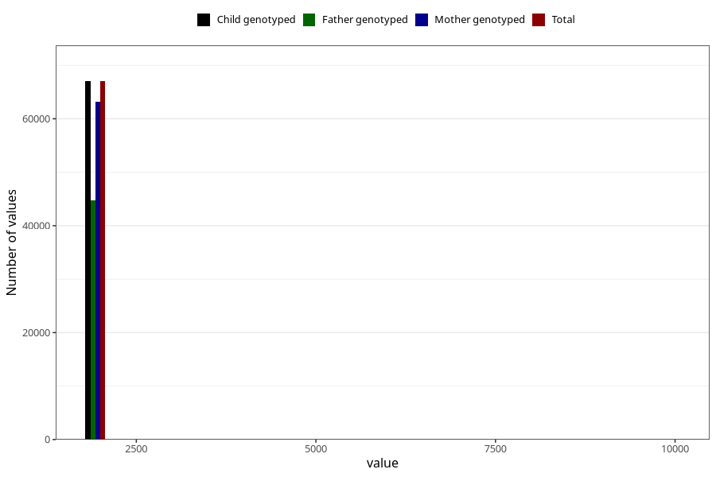

# q4_year_filled
Variable mapping to `DD11` in `Skjema4_6mnd_v12`.
- Number of values:

| Value | Total | Child genotyped | Mother genotyped | Father genotyped |
| ----- | ----- | --------------- | ---------------- | ---------------- |
| Missing | 13953 | 13953 | 13013 | 8558 |
| Non-missing | 67070 | 67070 | 63216 | 44753 |
| 2000 | 642 | 642 | 617 | 119 |
| 2001 | 1793 | 1793 | 1740 | 478 |
| 2002 | 4056 | 4056 | 3916 | 1755 |
| 2003 | 7124 | 7124 | 6755 | 4519 |
| 2004 | 8907 | 8907 | 8400 | 6018 |
| 2005 | 9157 | 9157 | 8602 | 6427 |
| 2006 | 10920 | 10920 | 10198 | 7904 |
| 2007 | 9559 | 9559 | 8963 | 6884 |
| 2008 | 9198 | 9198 | 8626 | 6456 |
| 2009 | 5640 | 5640 | 5330 | 4149 |
| 2010 | 22 | 22 | 21 | 15 |
| 2022 | 1 | 1 | 1 | 1 |
| 2066 | 1 | 1 | 1 | 1 |
| 9999 | 50 | 50 | 46 | 27 |

