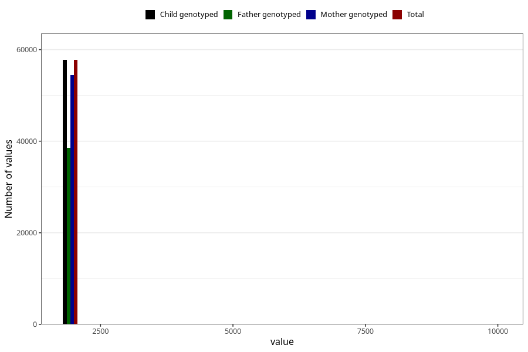

# q5_year_filled
Variable mapping to `EE11` in `Skjema5_18mnd_v12`.
- Number of values:

| Value | Total | Child genotyped | Mother genotyped | Father genotyped |
| ----- | ----- | --------------- | ---------------- | ---------------- |
| Missing | 23246 | 23246 | 21770 | 14732 |
| Non-missing | 57777 | 57777 | 54459 | 38579 |
| 2000 | 7 | 7 | 7 | 3 |
| 2001 | 387 | 387 | 373 | 89 |
| 2002 | 1761 | 1761 | 1707 | 451 |
| 2003 | 3587 | 3587 | 3467 | 1554 |
| 2004 | 6188 | 6188 | 5852 | 3918 |
| 2005 | 7898 | 7898 | 7449 | 5367 |
| 2006 | 7688 | 7688 | 7231 | 5398 |
| 2007 | 9353 | 9353 | 8729 | 6800 |
| 2008 | 8239 | 8239 | 7726 | 5953 |
| 2009 | 7854 | 7854 | 7377 | 5532 |
| 2010 | 4737 | 4737 | 4471 | 3466 |
| 2011 | 40 | 40 | 34 | 28 |
| 9999 | 38 | 38 | 36 | 20 |

