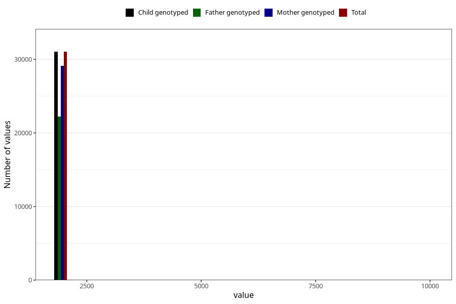

# q5y_year_filled
Variable mapping to `LL11` in `Skjema5aar_v12`.
- Number of values:

| Value | Total | Child genotyped | Mother genotyped | Father genotyped |
| ----- | ----- | --------------- | ---------------- | ---------------- |
| Missing | 49984 | 49984 | 47083 | 31086 |
| Non-missing | 31039 | 31039 | 29146 | 22225 |
| 2001 | 4 | 4 | 3 | 3 |
| 2003 | 1 | 1 | 1 | 1 |
| 2004 | 19 | 19 | 16 | 13 |
| 2005 | 22 | 22 | 20 | 19 |
| 2006 | 17 | 17 | 15 | 10 |
| 2007 | 21 | 21 | 21 | 15 |
| 2008 | 14 | 14 | 14 | 7 |
| 2009 | 14 | 14 | 14 | 11 |
| 2010 | 11491 | 11491 | 10798 | 8105 |
| 2011 | 6876 | 6876 | 6489 | 5052 |
| 2012 | 5255 | 5255 | 4851 | 3680 |
| 2013 | 5508 | 5508 | 5211 | 3958 |
| 2014 | 1778 | 1778 | 1675 | 1338 |
| 2015 | 5 | 5 | 5 | 2 |
| 2016 | 1 | 1 | 1 | 1 |
| 2017 | 1 | 1 | 1 | 1 |
| 2018 | 1 | 1 | 1 | 1 |
| 2021 | 1 | 1 | 1 | 1 |
| 9999 | 10 | 10 | 9 | 7 |

