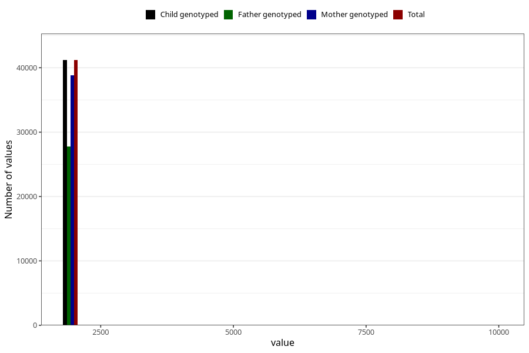

# q7y_year_filled
Variable mapping to `JJ11` in `Skjema7aar_v12`.
- Number of values:

| Value | Total | Child genotyped | Mother genotyped | Father genotyped |
| ----- | ----- | --------------- | ---------------- | ---------------- |
| Missing | 39828 | 39828 | 37431 | 25519 |
| Non-missing | 41195 | 41195 | 38798 | 27792 |
| 25th percentile | 2011 | 2011 | 2010 | 2011 |
| 50th percentile | 2012 | 2012 | 2012 | 2013 |
| 75th percentile | 2014 | 2014 | 2014 | 2014 |
| Mean | 2013.75412064571 | 2013.75412064571 | 2013.6302386721 | 2014.14885578584 |
| Standard deviation | 111.313583419404 | 111.313583419404 | 107.295548135462 | 117.357563501036 |
| N | 41195 | 41195 | 38798 | 27792 |

