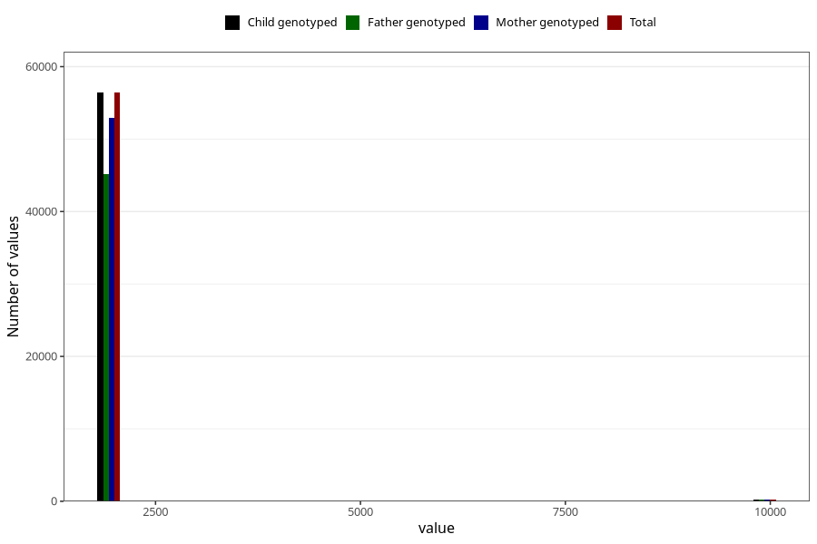

# qFar_year_filled
Variable mapping to `FF11` in `SkjemaFar_v12`.
- Number of values:

| Value | Total | Child genotyped | Mother genotyped | Father genotyped |
| ----- | ----- | --------------- | ---------------- | ---------------- |
| Missing | 24333 | 24333 | 23066 | 7870 |
| Non-missing | 56690 | 56690 | 53163 | 45441 |
| 2000 | 4 | 4 | 4 | 3 |
| 2001 | 968 | 968 | 925 | 783 |
| 2002 | 5350 | 5350 | 5033 | 4260 |
| 2003 | 7557 | 7557 | 7108 | 5982 |
| 2004 | 8528 | 8528 | 7994 | 6802 |
| 2005 | 10456 | 10456 | 9744 | 8354 |
| 2006 | 9140 | 9140 | 8552 | 7469 |
| 2007 | 8677 | 8677 | 8130 | 6874 |
| 2008 | 5644 | 5644 | 5327 | 4624 |
| 2009 | 84 | 84 | 82 | 67 |
| 9999 | 282 | 282 | 264 | 223 |

