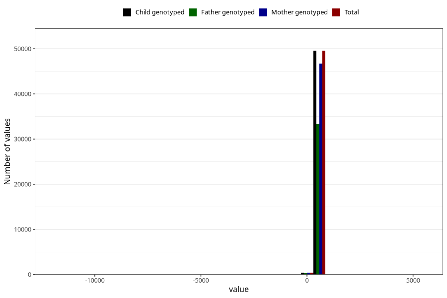

# age_15_18m_1
Variable mapping to `Q5_AGE_15_18_M` in `Skjema5_18mnd_v12`.
- Number of values:

| Value | Total | Child genotyped | Mother genotyped | Father genotyped |
| ----- | ----- | --------------- | ---------------- | ---------------- |
| Missing | 31018 | 31018 | 29070 | 19740 |
| Non-missing | 50005 | 50005 | 47159 | 33571 |
| 25th percentile | 461 | 461 | 461 | 460 |
| 50th percentile | 474 | 474 | 474 | 473 |
| 75th percentile | 512 | 512 | 512 | 510 |
| Mean | 485.173642635736 | 485.173642635736 | 485.345151508726 | 484.838670280897 |
| Standard deviation | 108.37588328892 | 108.37588328892 | 102.193856318477 | 83.556328669444 |
| N | 50005 | 50005 | 47159 | 33571 |

