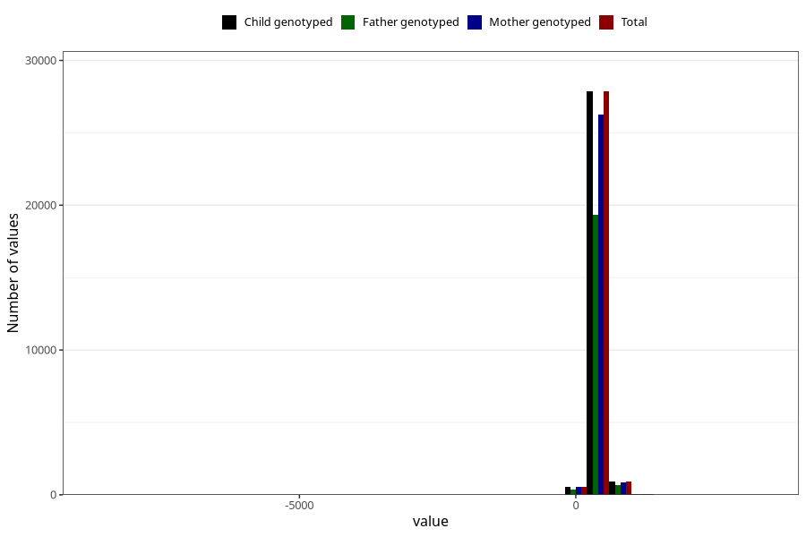

# age_15_18m_2
Variable mapping to `Q6_AGE_18_M` in `Skjema6_3aar_v12`.
- Number of values:

| Value | Total | Child genotyped | Mother genotyped | Father genotyped |
| ----- | ----- | --------------- | ---------------- | ---------------- |
| Missing | 51573 | 51573 | 48455 | 32893 |
| Non-missing | 29450 | 29450 | 27774 | 20418 |
| 25th percentile | 459 | 459 | 459 | 459 |
| 50th percentile | 474 | 474 | 474 | 473 |
| 75th percentile | 527 | 527 | 527 | 523 |
| Mean | 488.471578947368 | 488.471578947368 | 488.283034492691 | 487.576011362523 |
| Standard deviation | 111.567379047946 | 111.567379047946 | 112.191264266397 | 116.363995063467 |
| N | 29450 | 29450 | 27774 | 20418 |

