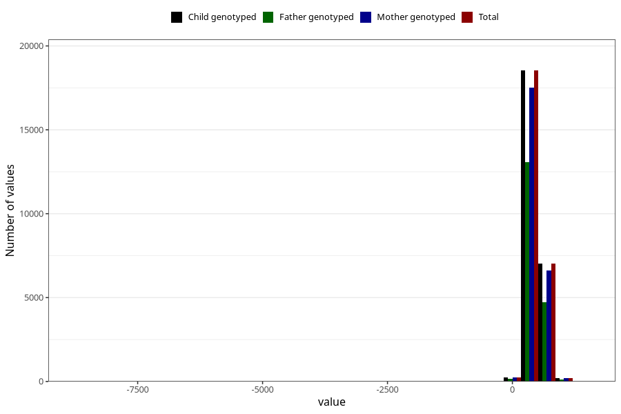

# age_16m
Variable created during phenotype curation.
- Number of values:

| Value | Total | Child genotyped | Mother genotyped | Father genotyped |
| ----- | ----- | --------------- | ---------------- | ---------------- |
| Missing | 55000 | 55000 | 51673 | 35197 |
| Non-missing | 26023 | 26023 | 24556 | 18114 |
| 25th percentile | 460 | 460 | 460 | 459 |
| 50th percentile | 474 | 474 | 474 | 473 |
| 75th percentile | 527 | 527 | 526 | 523 |
| Mean | 489.250778157783 | 489.250778157783 | 489.175028506271 | 488.467262890582 |
| Standard deviation | 108.129505978204 | 108.129505978204 | 108.95409910961 | 114.154736058246 |
| N | 26023 | 26023 | 24556 | 18114 |

