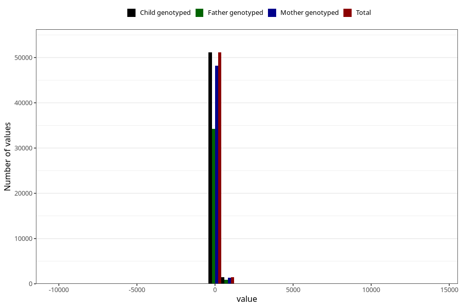

# age_1y
Variable mapping to `Q5_AGE_1_Y` in `Skjema5_18mnd_v12`.
- Number of values:

| Value | Total | Child genotyped | Mother genotyped | Father genotyped |
| ----- | ----- | --------------- | ---------------- | ---------------- |
| Missing | 28421 | 28421 | 26631 | 18067 |
| Non-missing | 52602 | 52602 | 49598 | 35244 |
| 25th percentile | 363 | 363 | 363 | 363 |
| 50th percentile | 369 | 369 | 369 | 369 |
| 75th percentile | 377 | 377 | 377 | 377 |
| Mean | 370.502889623969 | 370.502889623969 | 370.574498971733 | 370.904267393031 |
| Standard deviation | 89.2213012746622 | 89.2213012746622 | 91.364332543342 | 84.9927735599967 |
| N | 52602 | 52602 | 49598 | 35244 |

