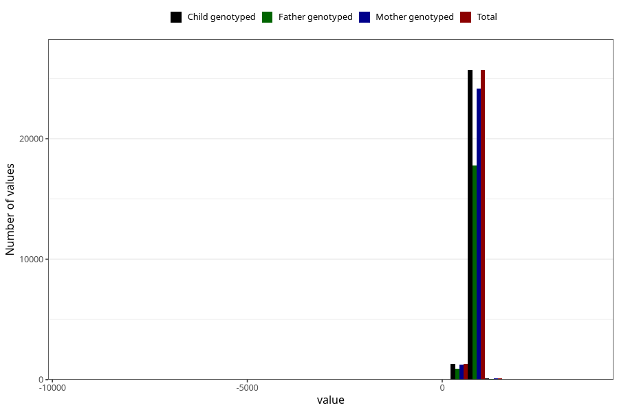

# age_2y
Variable mapping to `Q6_AGE_2_Y` in `Skjema6_3aar_v12`.
- Number of values:

| Value | Total | Child genotyped | Mother genotyped | Father genotyped |
| ----- | ----- | --------------- | ---------------- | ---------------- |
| Missing | 53887 | 53887 | 50668 | 34560 |
| Non-missing | 27136 | 27136 | 25561 | 18751 |
| 25th percentile | 734 | 734 | 734 | 734 |
| 50th percentile | 759 | 759 | 759 | 761 |
| 75th percentile | 806 | 806 | 806 | 808 |
| Mean | 767.904923349057 | 767.904923349057 | 767.721724502171 | 769.410751426591 |
| Standard deviation | 113.275321006291 | 113.275321006291 | 114.66917230762 | 92.1412001636654 |
| N | 27136 | 27136 | 25561 | 18751 |

