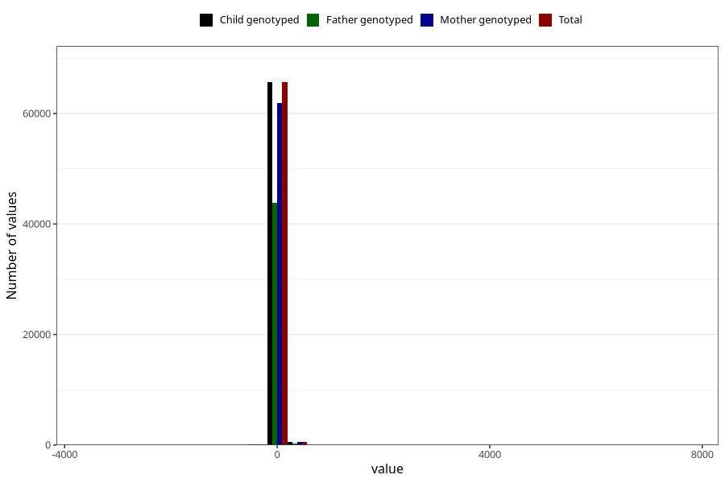

# age_3m
Variable mapping to `ALDER3MND_SJEKK` in `Skjema4_6mnd_v12`.
- Number of values:

| Value | Total | Child genotyped | Mother genotyped | Father genotyped |
| ----- | ----- | --------------- | ---------------- | ---------------- |
| Missing | 14637 | 14637 | 13645 | 9006 |
| Non-missing | 66386 | 66386 | 62584 | 44305 |
| 25th percentile | 90 | 90 | 90 | 90 |
| 50th percentile | 94 | 94 | 94 | 94 |
| 75th percentile | 99 | 99 | 99 | 98 |
| Mean | 95.8696110625734 | 95.8696110625734 | 95.907212706123 | 95.7247714704887 |
| Standard deviation | 62.336657787938 | 62.336657787938 | 62.8736852884117 | 65.0096618689503 |
| N | 66386 | 66386 | 62584 | 44305 |

