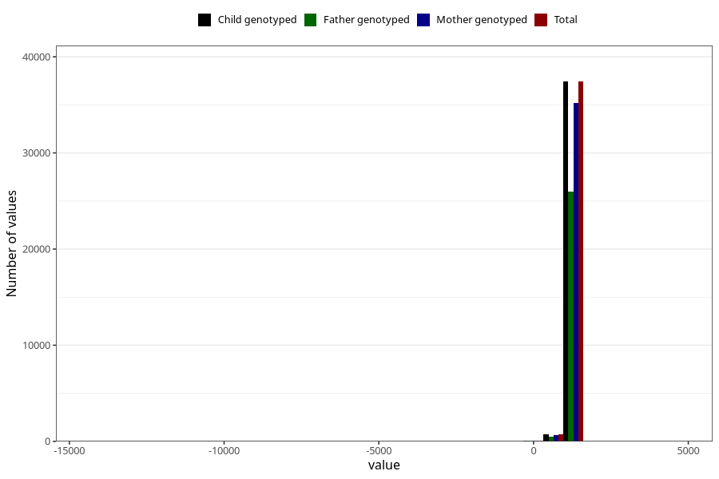

# age_3y
Variable mapping to `Q6_AGE_3_Y` in `Skjema6_3aar_v12`.
- Number of values:

| Value | Total | Child genotyped | Mother genotyped | Father genotyped |
| ----- | ----- | --------------- | ---------------- | ---------------- |
| Missing | 42783 | 42783 | 40286 | 26826 |
| Non-missing | 38240 | 38240 | 35943 | 26485 |
| 25th percentile | 1096 | 1096 | 1096 | 1096 |
| 50th percentile | 1103 | 1103 | 1103 | 1103 |
| 75th percentile | 1119 | 1119 | 1119 | 1119 |
| Mean | 1096.86974372385 | 1096.86974372385 | 1096.89767131291 | 1097.99607324901 |
| Standard deviation | 173.668890875353 | 173.668890875353 | 177.503453271466 | 154.431151819032 |
| N | 38240 | 38240 | 35943 | 26485 |

