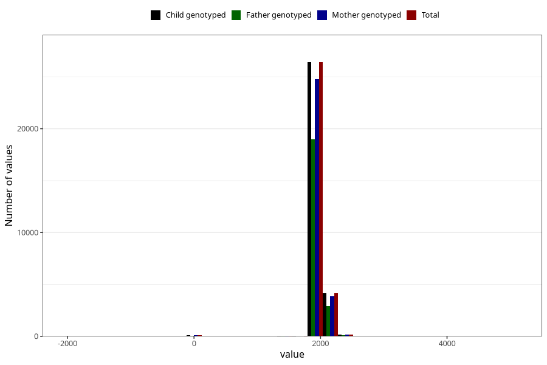

# age_5y
Variable mapping to `AGE_MTHS_Q5AAR` in `Skjema5aar_v12`.
- Number of values:

| Value | Total | Child genotyped | Mother genotyped | Father genotyped |
| ----- | ----- | --------------- | ---------------- | ---------------- |
| Missing | 50097 | 50097 | 47191 | 31158 |
| Non-missing | 30926 | 30926 | 29038 | 22153 |
| 25th percentile | 1826.25 | 1826.25 | 1826.25 | 1826.25 |
| 50th percentile | 1856.6875 | 1856.6875 | 1856.6875 | 1856.6875 |
| 75th percentile | 1948 | 1948 | 1948 | 1948 |
| Mean | 1898.58015302658 | 1898.58015302658 | 1898.95388585646 | 1898.23215253013 |
| Standard deviation | 162.057040102843 | 162.057040102843 | 160.869956807684 | 161.923270474429 |
| N | 30926 | 30926 | 29038 | 22153 |

