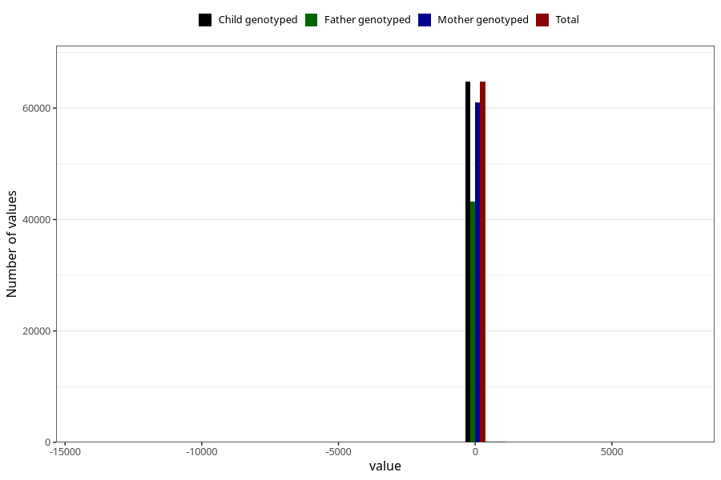

# age_6m
Variable mapping to `ALDER6MND_SJEKK` in `Skjema4_6mnd_v12`.
- Number of values:

| Value | Total | Child genotyped | Mother genotyped | Father genotyped |
| ----- | ----- | --------------- | ---------------- | ---------------- |
| Missing | 16132 | 16132 | 15057 | 9954 |
| Non-missing | 64891 | 64891 | 61172 | 43357 |
| 25th percentile | 167 | 167 | 167 | 167 |
| 50th percentile | 181 | 181 | 181 | 181 |
| 75th percentile | 187 | 187 | 187 | 187 |
| Mean | 172.685364688478 | 172.685364688478 | 172.637399463807 | 172.141384320871 |
| Standard deviation | 124.404848866495 | 124.404848866495 | 127.558556112118 | 134.503413411174 |
| N | 64891 | 64891 | 61172 | 43357 |

