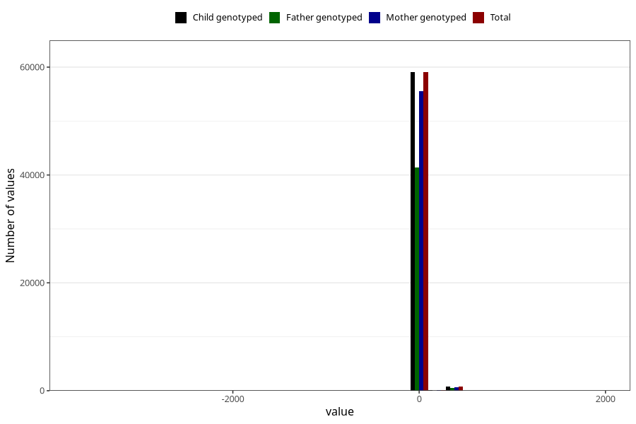

# age_6w
Variable mapping to `ALDER6UK_SJEKK` in `Skjema4_6mnd_v12`.
- Number of values:

| Value | Total | Child genotyped | Mother genotyped | Father genotyped |
| ----- | ----- | --------------- | ---------------- | ---------------- |
| Missing | 21062 | 21062 | 19858 | 11345 |
| Non-missing | 59961 | 59961 | 56371 | 41966 |
| 25th percentile | 40 | 40 | 40 | 40 |
| 50th percentile | 44 | 44 | 44 | 44 |
| 75th percentile | 48 | 48 | 48 | 48 |
| Mean | 46.7777055085806 | 46.7777055085806 | 46.7896613506945 | 46.7693847400276 |
| Standard deviation | 60.3972835083018 | 60.3972835083018 | 60.0673226785019 | 60.1809032842839 |
| N | 59961 | 59961 | 56371 | 41966 |

