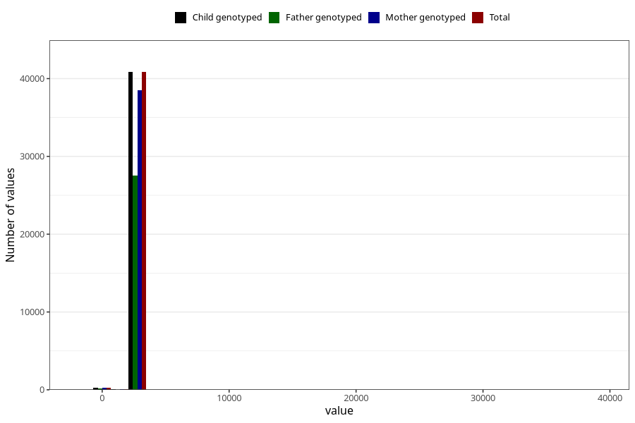

# age_7y
Variable mapping to `AGE_MTHS_Q7` in `Skjema7aar_v12`.
- Number of values:

| Value | Total | Child genotyped | Mother genotyped | Father genotyped |
| ----- | ----- | --------------- | ---------------- | ---------------- |
| Missing | 39901 | 39901 | 37501 | 25565 |
| Non-missing | 41122 | 41122 | 38728 | 27746 |
| 25th percentile | 2556.75 | 2556.75 | 2556.75 | 2556.75 |
| 50th percentile | 2587.1875 | 2587.1875 | 2587.1875 | 2587.1875 |
| 75th percentile | 2617.625 | 2617.625 | 2617.625 | 2617.625 |
| Mean | 2590.6648448519 | 2590.6648448519 | 2590.77369893875 | 2586.90776373171 |
| Standard deviation | 281.056548420179 | 281.056548420179 | 285.981101544007 | 300.664484756379 |
| N | 41122 | 41122 | 38728 | 27746 |

