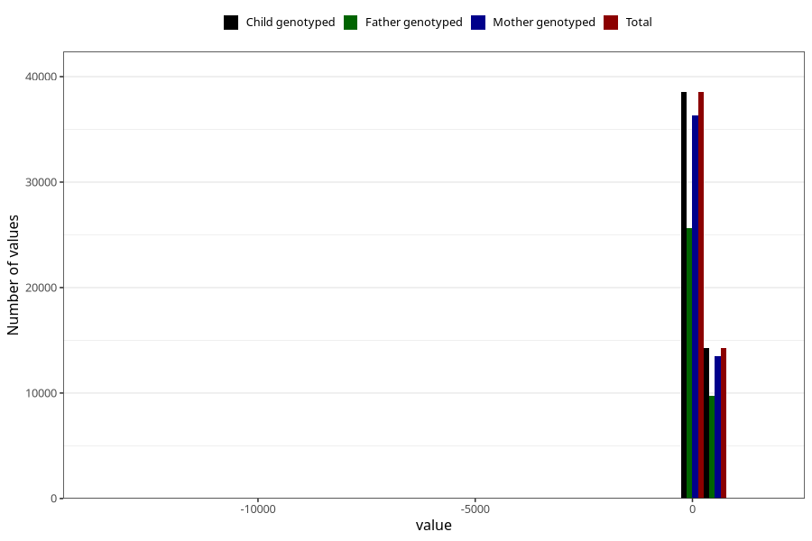

# age_8m
Variable mapping to `Q5_AGE_8_M` in `Skjema5_18mnd_v12`.
- Number of values:

| Value | Total | Child genotyped | Mother genotyped | Father genotyped |
| ----- | ----- | --------------- | ---------------- | ---------------- |
| Missing | 28177 | 28177 | 26390 | 17908 |
| Non-missing | 52846 | 52846 | 49839 | 35403 |
| 25th percentile | 234 | 234 | 234 | 234 |
| 50th percentile | 246 | 246 | 246 | 246 |
| 75th percentile | 260 | 260 | 260 | 261 |
| Mean | 249.937308405556 | 249.937308405556 | 250.036999137222 | 250.76504815976 |
| Standard deviation | 87.3650010914069 | 87.3650010914069 | 87.9943715587088 | 65.9810914237779 |
| N | 52846 | 52846 | 49839 | 35403 |

