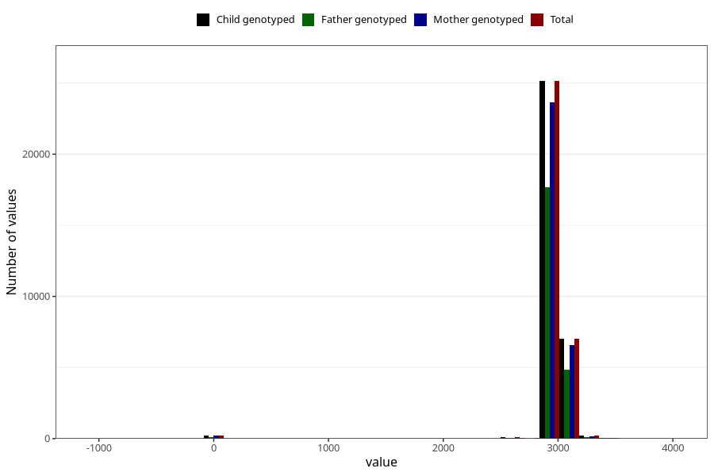

# age_8y
Variable mapping to `AGE_MTHS_Q8AAR` in `Skjema8aar_v12`.
- Number of values:

| Value | Total | Child genotyped | Mother genotyped | Father genotyped |
| ----- | ----- | --------------- | ---------------- | ---------------- |
| Missing | 48263 | 48263 | 45467 | 30383 |
| Non-missing | 32760 | 32760 | 30762 | 22928 |
| 25th percentile | 2922 | 2922 | 2922 | 2922 |
| 50th percentile | 2952.4375 | 2952.4375 | 2952.4375 | 2952.4375 |
| 75th percentile | 2982.875 | 2982.875 | 2982.875 | 2982.875 |
| Mean | 2950.59508356227 | 2950.59508356227 | 2950.23794982446 | 2952.08437827111 |
| Standard deviation | 250.273877791798 | 250.273877791798 | 252.588631025815 | 238.168718774381 |
| N | 32760 | 32760 | 30762 | 22928 |

