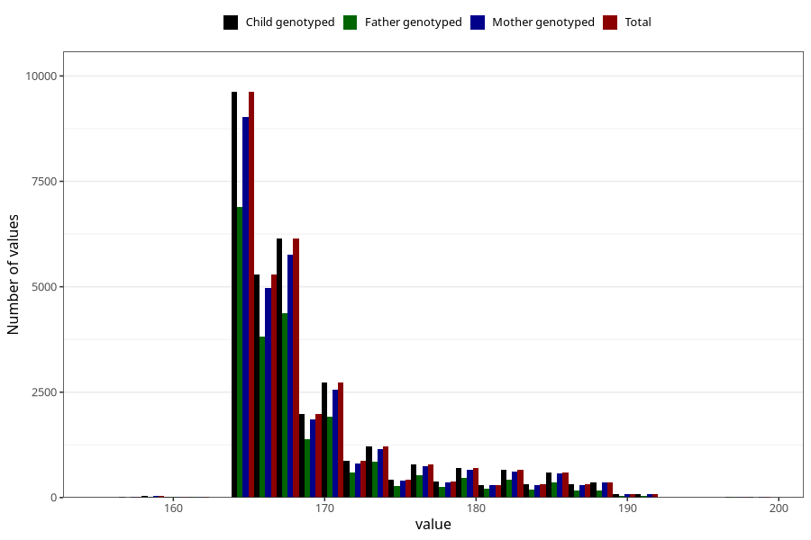

# age_answering_q_13
Variable mapping to `AGE_MTHS_KOST` in `Kosthold_ungdom_v12`.
- Number of values:

| Value | Total | Child genotyped | Mother genotyped | Father genotyped |
| ----- | ----- | --------------- | ---------------- | ---------------- |
| Missing | 48047 | 48047 | 45191 | 30291 |
| Non-missing | 32976 | 32976 | 31038 | 23020 |
| 25th percentile | 165 | 165 | 165 | 165 |
| 50th percentile | 167 | 167 | 167 | 167 |
| 75th percentile | 171 | 171 | 171 | 170 |
| Mean | 169.186317321689 | 169.186317321689 | 169.225433339777 | 168.879061685491 |
| Standard deviation | 6.07276390549427 | 6.07276390549427 | 6.11380414461534 | 5.71058400694291 |
| N | 32976 | 32976 | 31038 | 23020 |

