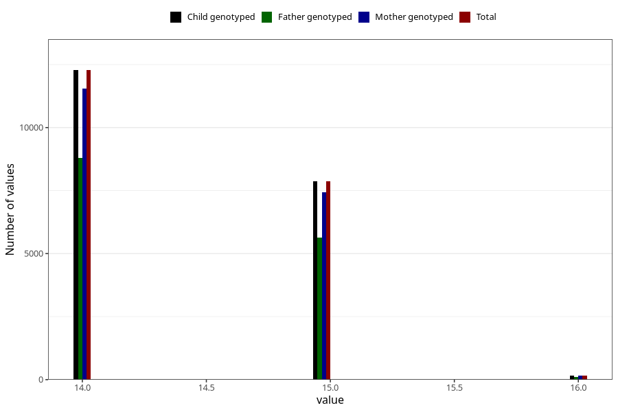

# age_answering_q_14c
Variable mapping to `AGE_YRS_UB` in `Ungdomsskjema_Barn_v12_standard`.
- Number of values:

| Value | Total | Child genotyped | Mother genotyped | Father genotyped |
| ----- | ----- | --------------- | ---------------- | ---------------- |
| Missing | 60703 | 60703 | 57094 | 38792 |
| Non-missing | 20320 | 20320 | 19135 | 14519 |
| 14 | 12276 | 12276 | 11553 | 8785 |
| 15 | 7875 | 7875 | 7427 | 5623 |
| 16 | 169 | 169 | 155 | 111 |

