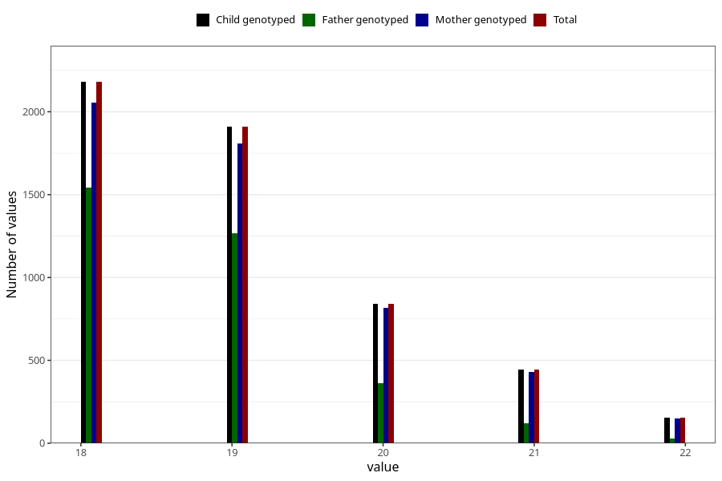

# age_answering_q_18
Variable mapping to `AGE_YRS_VE` in `18-aarsskjema_v12_standard`.
- Number of values:

| Value | Total | Child genotyped | Mother genotyped | Father genotyped |
| ----- | ----- | --------------- | ---------------- | ---------------- |
| Missing | 75496 | 75496 | 70976 | 49988 |
| Non-missing | 5527 | 5527 | 5253 | 3323 |
| 18 | 2180 | 2180 | 2053 | 1544 |
| 19 | 1910 | 1910 | 1808 | 1269 |
| 20 | 841 | 841 | 816 | 362 |
| 21 | 443 | 443 | 429 | 119 |
| 22 | 153 | 153 | 147 | 29 |

