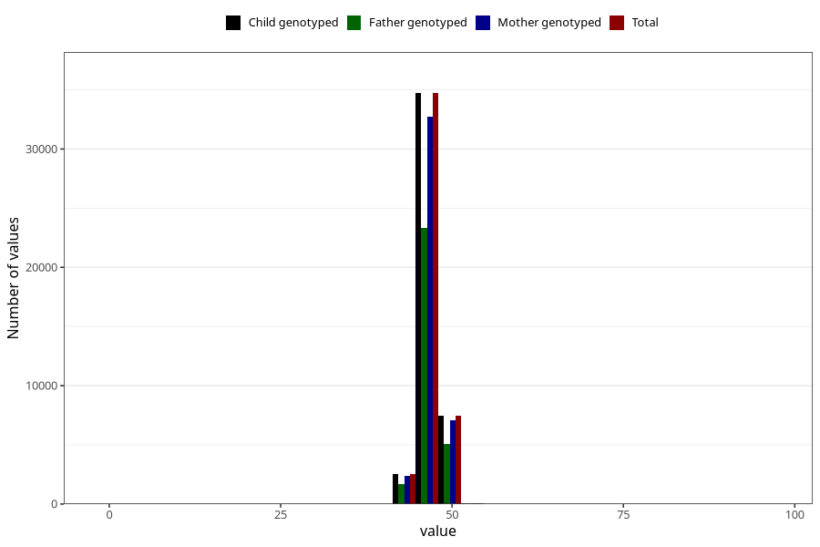

# hc_1y
Variable mapping to `EE394` in `Skjema5_18mnd_v12`.
- Number of values:

| Value | Total | Child genotyped | Mother genotyped | Father genotyped |
| ----- | ----- | --------------- | ---------------- | ---------------- |
| Missing | 36139 | 36139 | 33944 | 23135 |
| Non-missing | 44884 | 44884 | 42285 | 30176 |
| 25th percentile | 46 | 46 | 46 | 46 |
| 50th percentile | 47 | 47 | 47 | 47 |
| 75th percentile | 47.8 | 47.8 | 47.8 | 47.8 |
| Mean | 46.8494764281258 | 46.8494764281258 | 46.8495423909188 | 46.8571546924708 |
| Standard deviation | 1.58305039842594 | 1.58305039842594 | 1.58542162123708 | 1.57082572707845 |
| N | 44884 | 44884 | 42285 | 30176 |

