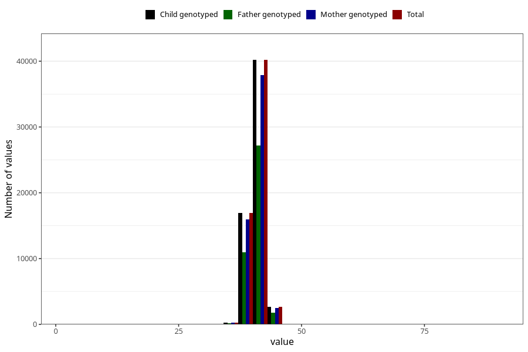

# hc_3m
Variable mapping to `DD220` in `Skjema4_6mnd_v12`.
- Number of values:

| Value | Total | Child genotyped | Mother genotyped | Father genotyped |
| ----- | ----- | --------------- | ---------------- | ---------------- |
| Missing | 20904 | 20904 | 19561 | 13063 |
| Non-missing | 60119 | 60119 | 56668 | 40248 |
| 25th percentile | 40 | 40 | 40 | 40 |
| 50th percentile | 41 | 41 | 41 | 41 |
| 75th percentile | 42 | 42 | 42 | 42 |
| Mean | 40.9704153429032 | 40.9704153429032 | 40.9699460012706 | 40.9809953289604 |
| Standard deviation | 1.38574760659031 | 1.38574760659031 | 1.38662797158125 | 1.38675852102842 |
| N | 60119 | 60119 | 56668 | 40248 |

