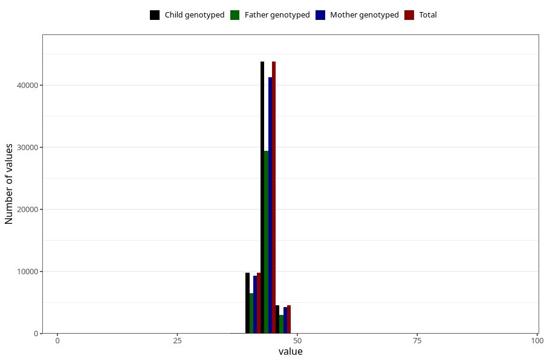

# hc_6m
Variable mapping to `DD226` in `Skjema4_6mnd_v12`.
- Number of values:

| Value | Total | Child genotyped | Mother genotyped | Father genotyped |
| ----- | ----- | --------------- | ---------------- | ---------------- |
| Missing | 22716 | 22716 | 21295 | 14254 |
| Non-missing | 58307 | 58307 | 54934 | 39057 |
| 25th percentile | 42.8 | 42.8 | 42.8 | 42.8 |
| 50th percentile | 43.6 | 43.6 | 43.6 | 43.6 |
| 75th percentile | 44.5 | 44.5 | 44.5 | 44.5 |
| Mean | 43.6661430016979 | 43.6661430016979 | 43.6655659518695 | 43.6718001894667 |
| Standard deviation | 1.50947074141204 | 1.50947074141204 | 1.51008553979971 | 1.50845443384989 |
| N | 58307 | 58307 | 54934 | 39057 |

