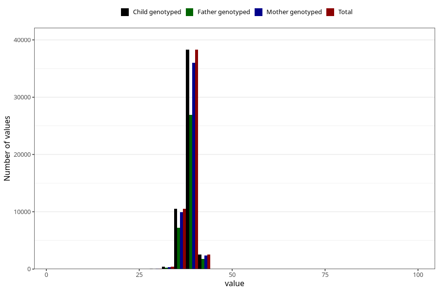

# hc_6w
Variable mapping to `DD214` in `Skjema4_6mnd_v12`.
- Number of values:

| Value | Total | Child genotyped | Mother genotyped | Father genotyped |
| ----- | ----- | --------------- | ---------------- | ---------------- |
| Missing | 29203 | 29203 | 27524 | 17090 |
| Non-missing | 51820 | 51820 | 48705 | 36221 |
| 25th percentile | 37.9 | 37.9 | 37.9 | 38 |
| 50th percentile | 38.7 | 38.7 | 38.7 | 38.7 |
| 75th percentile | 39.5 | 39.5 | 39.5 | 39.5 |
| Mean | 38.6337881126978 | 38.6337881126978 | 38.6324032440201 | 38.6419894536319 |
| Standard deviation | 1.49580958382834 | 1.49580958382834 | 1.49544054362576 | 1.51627366117423 |
| N | 51820 | 51820 | 48705 | 36221 |

