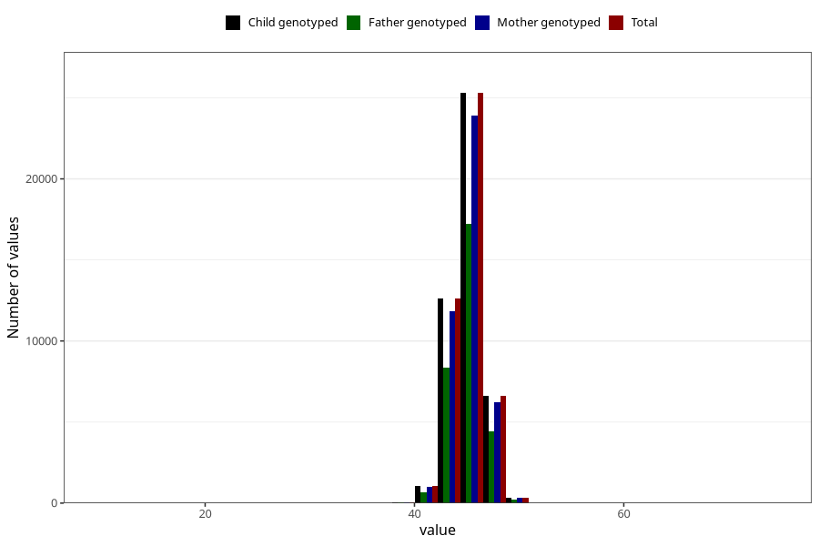

# hc_8m
Variable mapping to `EE388` in `Skjema5_18mnd_v12`.
- Number of values:

| Value | Total | Child genotyped | Mother genotyped | Father genotyped |
| ----- | ----- | --------------- | ---------------- | ---------------- |
| Missing | 34969 | 34969 | 32814 | 22344 |
| Non-missing | 46054 | 46054 | 43415 | 30967 |
| 25th percentile | 44 | 44 | 44 | 44 |
| 50th percentile | 45 | 45 | 45 | 45 |
| 75th percentile | 46 | 46 | 46 | 46 |
| Mean | 45.1155491379685 | 45.1155491379685 | 45.1177956927329 | 45.1281073400717 |
| Standard deviation | 1.51359214482085 | 1.51359214482085 | 1.51528286584947 | 1.50663793560094 |
| N | 46054 | 46054 | 43415 | 30967 |

