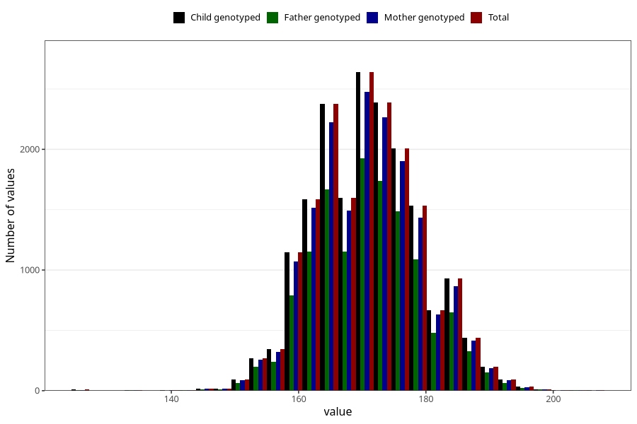

# height_14c
Variable mapping to `UB220` in `Ungdomsskjema_Barn_v12_standard`.
- Number of values:

| Value | Total | Child genotyped | Mother genotyped | Father genotyped |
| ----- | ----- | --------------- | ---------------- | ---------------- |
| Missing | 62597 | 62597 | 58893 | 40057 |
| Non-missing | 18426 | 18426 | 17336 | 13254 |
| 25th percentile | 165 | 165 | 165 | 165 |
| 50th percentile | 170 | 170 | 170 | 170 |
| 75th percentile | 176 | 176 | 176 | 176 |
| Mean | 170.807554542494 | 170.807554542494 | 170.807568066451 | 170.883431416931 |
| Standard deviation | 8.36033663669371 | 8.36033663669371 | 8.35110706187561 | 8.32918386283783 |
| N | 18426 | 18426 | 17336 | 13254 |

