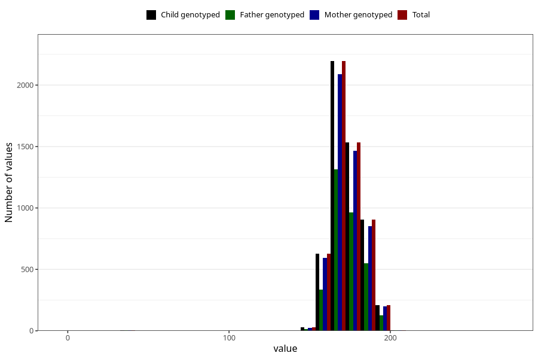

# height_18
Variable mapping to `VE43` in `18-aarsskjema_v12_standard`.
- Number of values:

| Value | Total | Child genotyped | Mother genotyped | Father genotyped |
| ----- | ----- | --------------- | ---------------- | ---------------- |
| Missing | 75512 | 75512 | 70991 | 49997 |
| Non-missing | 5511 | 5511 | 5238 | 3314 |
| 25th percentile | 166 | 166 | 166 | 167 |
| 50th percentile | 172 | 172 | 172 | 172 |
| 75th percentile | 180 | 180 | 180 | 180 |
| Mean | 172.829613500272 | 172.829613500272 | 172.841733486063 | 173.243512371756 |
| Standard deviation | 10.83463397999 | 10.83463397999 | 10.8962839809828 | 10.4282940352369 |
| N | 5511 | 5511 | 5238 | 3314 |

