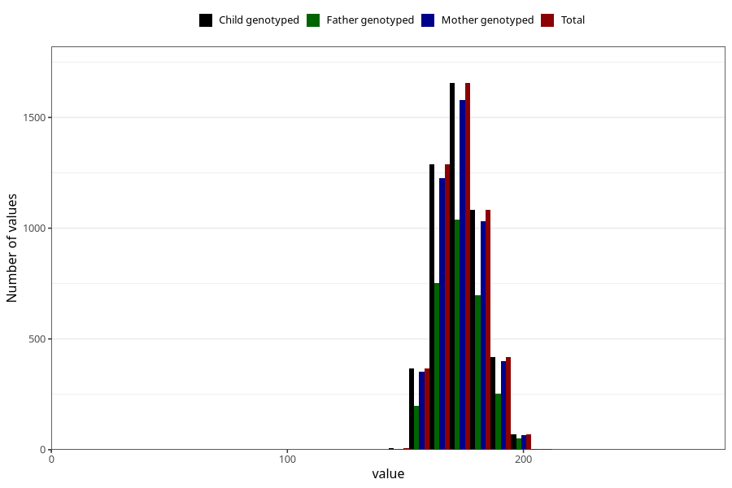

# height_19
Variable mapping to `VG134` in `19_aarsskjema_standard`.
- Number of values:

| Value | Total | Child genotyped | Mother genotyped | Father genotyped |
| ----- | ----- | --------------- | ---------------- | ---------------- |
| Missing | 76128 | 76128 | 71563 | 50310 |
| Non-missing | 4895 | 4895 | 4666 | 3001 |
| 25th percentile | 166 | 166 | 166 | 167 |
| 50th percentile | 172 | 172 | 172 | 173 |
| 75th percentile | 180 | 180 | 180 | 180 |
| Mean | 173.266598569969 | 173.266598569969 | 173.237676810973 | 173.532155948017 |
| Standard deviation | 9.91194464688518 | 9.91194464688518 | 9.92297685964491 | 9.99881904611767 |
| N | 4895 | 4895 | 4666 | 3001 |

