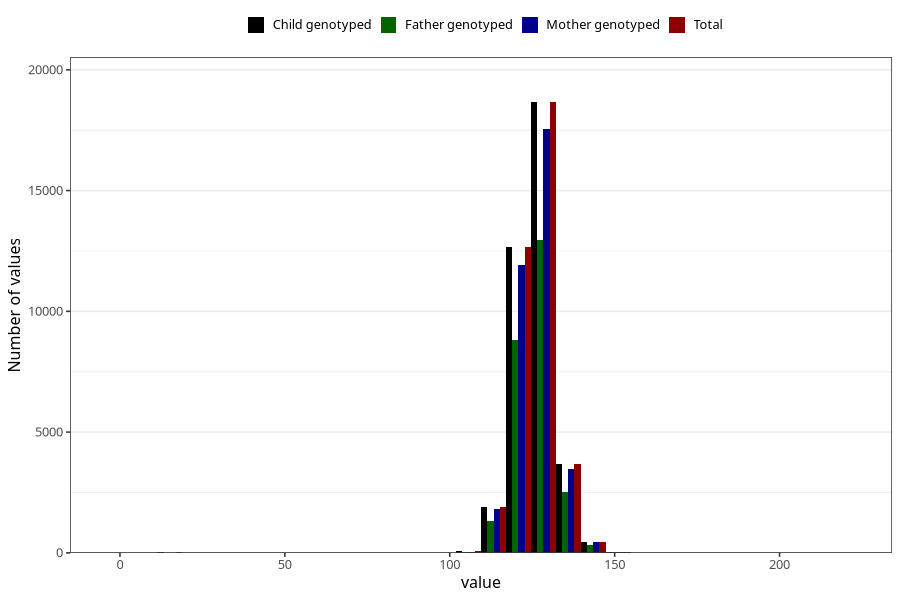

# height_7y_cm
Variable mapping to `JJ408` in `Skjema7aar_v12`.
- Number of values:

| Value | Total | Child genotyped | Mother genotyped | Father genotyped |
| ----- | ----- | --------------- | ---------------- | ---------------- |
| Missing | 43511 | 43511 | 40928 | 27255 |
| Non-missing | 37512 | 37512 | 35301 | 26056 |
| 25th percentile | 122 | 122 | 122 | 122 |
| 50th percentile | 126 | 126 | 126 | 126 |
| 75th percentile | 130 | 130 | 130 | 130 |
| Mean | 125.897872680742 | 125.897872680742 | 125.911333956545 | 125.885746085355 |
| Standard deviation | 6.67816177092449 | 6.67816177092449 | 6.5673466326019 | 6.49577417834211 |
| N | 37512 | 37512 | 35301 | 26056 |

