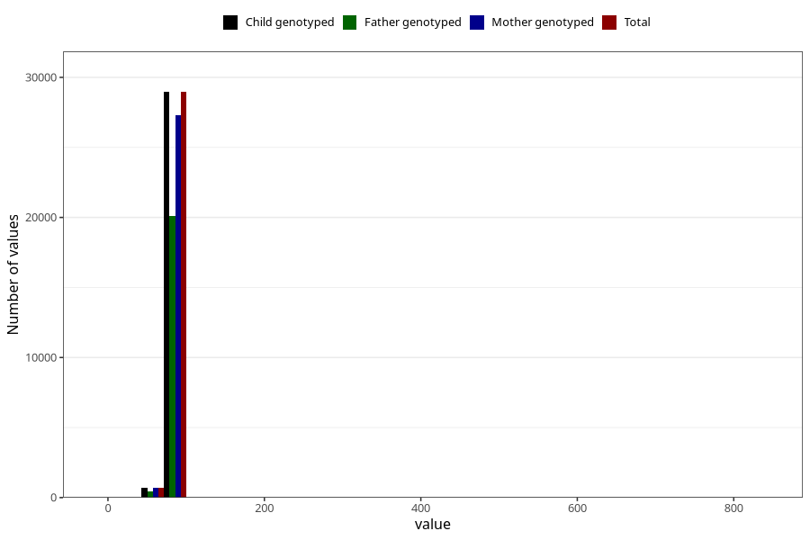

# length_15_18m_2
Variable mapping to `GG15` in `Skjema6_3aar_v12`.
- Number of values:

| Value | Total | Child genotyped | Mother genotyped | Father genotyped |
| ----- | ----- | --------------- | ---------------- | ---------------- |
| Missing | 51345 | 51345 | 48246 | 32756 |
| Non-missing | 29678 | 29678 | 27983 | 20555 |
| 25th percentile | 78.5 | 78.5 | 78.5 | 78.2 |
| 50th percentile | 80.5 | 80.5 | 80.5 | 80.5 |
| 75th percentile | 83 | 83 | 83 | 83 |
| Mean | 80.5381461014893 | 80.5381461014893 | 80.5108172819212 | 80.520082704938 |
| Standard deviation | 8.39382163829675 | 8.39382163829675 | 7.32473111636054 | 8.48819931310704 |
| N | 29678 | 29678 | 27983 | 20555 |

