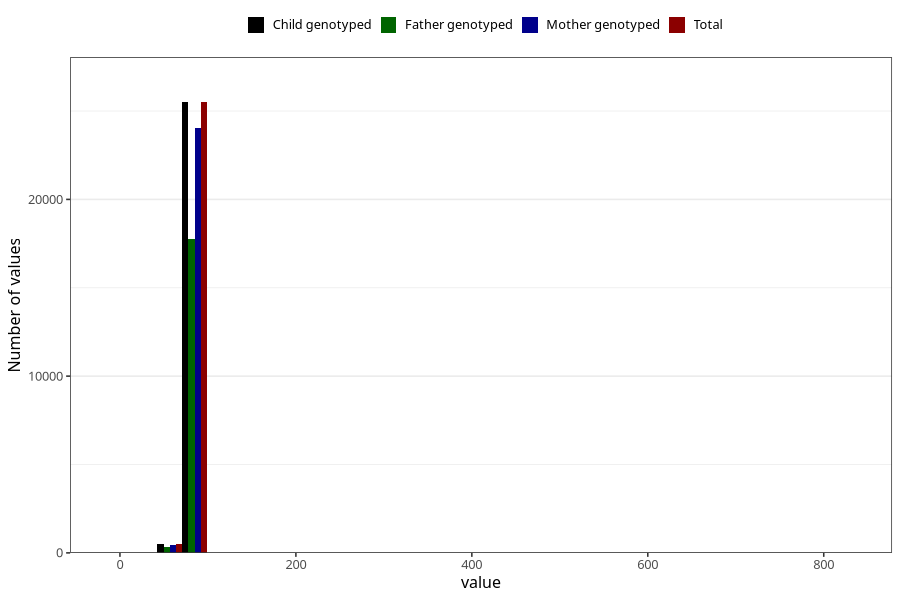

# length_16m
Variable created during phenotype curation.
- Number of values:

| Value | Total | Child genotyped | Mother genotyped | Father genotyped |
| ----- | ----- | --------------- | ---------------- | ---------------- |
| Missing | 55018 | 55018 | 51696 | 35225 |
| Non-missing | 26005 | 26005 | 24533 | 18086 |
| 25th percentile | 78.5 | 78.5 | 78.5 | 78.5 |
| 50th percentile | 80.5 | 80.5 | 80.5 | 80.5 |
| 75th percentile | 83 | 83 | 83 | 83 |
| Mean | 80.5552086137281 | 80.5552086137281 | 80.5255533363225 | 80.5220557337167 |
| Standard deviation | 7.42836793440834 | 7.42836793440834 | 5.88876221344936 | 6.86154213041059 |
| N | 26005 | 26005 | 24533 | 18086 |

