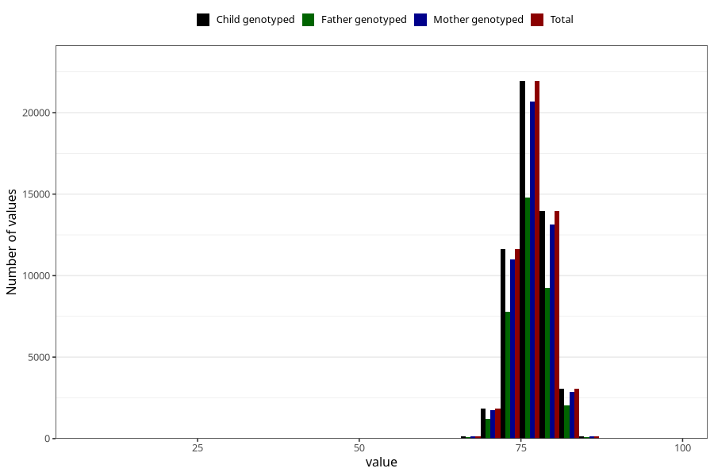

# length_1y
Variable mapping to `EE393` in `Skjema5_18mnd_v12`.
- Number of values:

| Value | Total | Child genotyped | Mother genotyped | Father genotyped |
| ----- | ----- | --------------- | ---------------- | ---------------- |
| Missing | 28310 | 28310 | 26532 | 17999 |
| Non-missing | 52713 | 52713 | 49697 | 35312 |
| 25th percentile | 74.5 | 74.5 | 74.5 | 74.5 |
| 50th percentile | 76.5 | 76.5 | 76.5 | 76.5 |
| 75th percentile | 78 | 78 | 78 | 78 |
| Mean | 76.4408570940755 | 76.4408570940755 | 76.4380284524217 | 76.4428098096964 |
| Standard deviation | 2.7997690051054 | 2.7997690051054 | 2.79832524837 | 2.77964741672096 |
| N | 52713 | 52713 | 49697 | 35312 |

