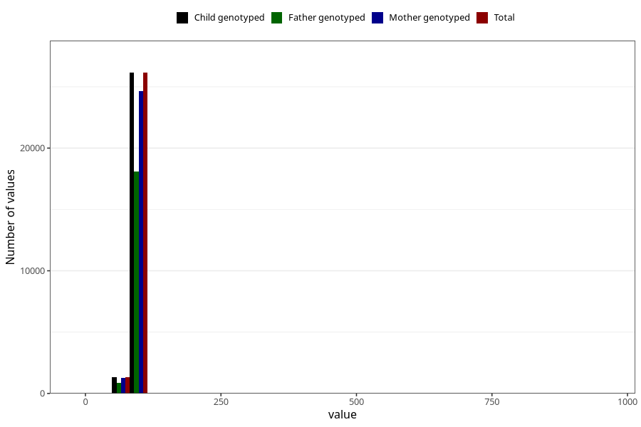

# length_2y
Variable mapping to `GG20` in `Skjema6_3aar_v12`.
- Number of values:

| Value | Total | Child genotyped | Mother genotyped | Father genotyped |
| ----- | ----- | --------------- | ---------------- | ---------------- |
| Missing | 53549 | 53549 | 50340 | 34350 |
| Non-missing | 27474 | 27474 | 25889 | 18961 |
| 25th percentile | 86 | 86 | 86 | 86 |
| 50th percentile | 88.5 | 88.5 | 88.5 | 88.5 |
| 75th percentile | 91 | 91 | 91 | 91 |
| Mean | 88.4819684064934 | 88.4819684064934 | 88.4745451736259 | 88.4967406782343 |
| Standard deviation | 9.22825539699721 | 9.22825539699721 | 9.45697866690995 | 9.42697124449925 |
| N | 27474 | 27474 | 25889 | 18961 |

