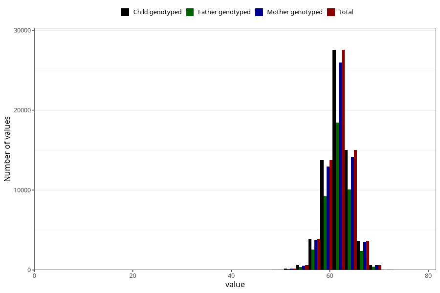

# length_3m
Variable mapping to `DD219` in `Skjema4_6mnd_v12`.
- Number of values:

| Value | Total | Child genotyped | Mother genotyped | Father genotyped |
| ----- | ----- | --------------- | ---------------- | ---------------- |
| Missing | 15643 | 15643 | 14582 | 9691 |
| Non-missing | 65380 | 65380 | 61647 | 43620 |
| 25th percentile | 60.5 | 60.5 | 60.5 | 60.5 |
| 50th percentile | 62 | 62 | 62 | 62 |
| 75th percentile | 63.8 | 63.8 | 63.6 | 63.5 |
| Mean | 61.9815952890792 | 61.9815952890792 | 61.9791587587393 | 61.9862608895002 |
| Standard deviation | 2.58705100878584 | 2.58705100878584 | 2.58471132262565 | 2.56222694235427 |
| N | 65380 | 65380 | 61647 | 43620 |

