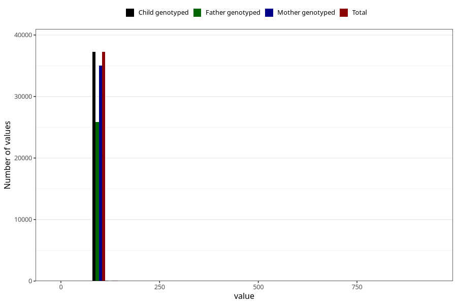

# length_3y
Variable mapping to `GG25` in `Skjema6_3aar_v12`.
- Number of values:

| Value | Total | Child genotyped | Mother genotyped | Father genotyped |
| ----- | ----- | --------------- | ---------------- | ---------------- |
| Missing | 43673 | 43673 | 41093 | 27414 |
| Non-missing | 37350 | 37350 | 35136 | 25897 |
| 25th percentile | 94 | 94 | 94 | 94 |
| 50th percentile | 97 | 97 | 97 | 97 |
| 75th percentile | 99 | 99 | 99 | 99 |
| Mean | 96.6590896921017 | 96.6590896921017 | 96.6547472677596 | 96.6612078619145 |
| Standard deviation | 6.35886328528183 | 6.35886328528183 | 6.4523461162835 | 6.91990422667925 |
| N | 37350 | 37350 | 35136 | 25897 |

