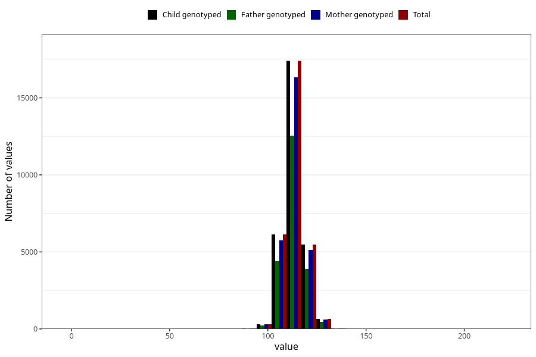

# length_5y
Variable mapping to `LL12` in `Skjema5aar_v12`.
- Number of values:

| Value | Total | Child genotyped | Mother genotyped | Father genotyped |
| ----- | ----- | --------------- | ---------------- | ---------------- |
| Missing | 50961 | 50961 | 47976 | 31748 |
| Non-missing | 30062 | 30062 | 28253 | 21563 |
| 25th percentile | 110 | 110 | 110 | 110 |
| 50th percentile | 113 | 113 | 113 | 113 |
| 75th percentile | 117 | 117 | 117 | 116 |
| Mean | 113.202215421462 | 113.202215421462 | 113.209287509291 | 113.187172471363 |
| Standard deviation | 6.22266747580048 | 6.22266747580048 | 6.25568262957977 | 6.23425229474237 |
| N | 30062 | 30062 | 28253 | 21563 |

