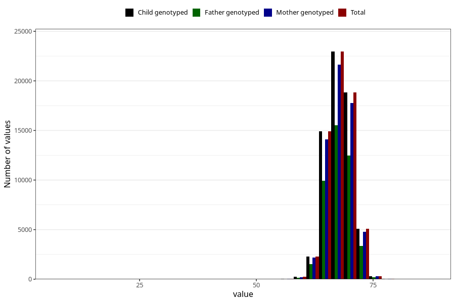

# length_6m
Variable mapping to `DD225` in `Skjema4_6mnd_v12`.
- Number of values:

| Value | Total | Child genotyped | Mother genotyped | Father genotyped |
| ----- | ----- | --------------- | ---------------- | ---------------- |
| Missing | 16325 | 16325 | 15230 | 10134 |
| Non-missing | 64698 | 64698 | 60999 | 43177 |
| 25th percentile | 66 | 66 | 66 | 66 |
| 50th percentile | 68 | 68 | 68 | 68 |
| 75th percentile | 69.5 | 69.5 | 69.5 | 69.5 |
| Mean | 67.839661195091 | 67.839661195091 | 67.8371547074542 | 67.8306644741413 |
| Standard deviation | 2.6083114070733 | 2.6083114070733 | 2.60691754605976 | 2.57970020828661 |
| N | 64698 | 64698 | 60999 | 43177 |

