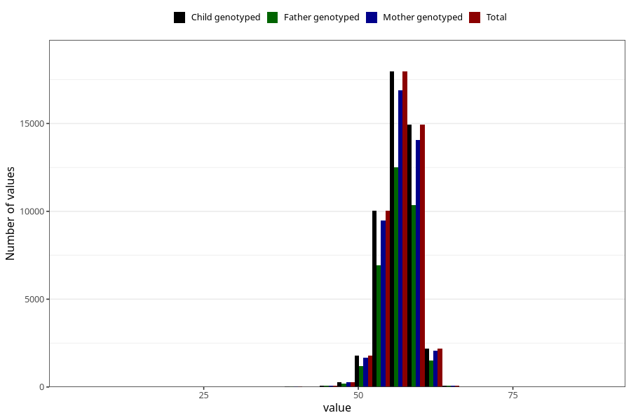

# length_6w
Variable mapping to `DD213` in `Skjema4_6mnd_v12`.
- Number of values:

| Value | Total | Child genotyped | Mother genotyped | Father genotyped |
| ----- | ----- | --------------- | ---------------- | ---------------- |
| Missing | 33595 | 33595 | 31597 | 20462 |
| Non-missing | 47428 | 47428 | 44632 | 32849 |
| 25th percentile | 55 | 55 | 55 | 55 |
| 50th percentile | 57 | 57 | 57 | 57 |
| 75th percentile | 58.5 | 58.5 | 58.5 | 58.5 |
| Mean | 56.7405351269292 | 56.7405351269292 | 56.7387905538627 | 56.7519650522086 |
| Standard deviation | 2.61645024890612 | 2.61645024890612 | 2.61365500546658 | 2.58134580988402 |
| N | 47428 | 47428 | 44632 | 32849 |

