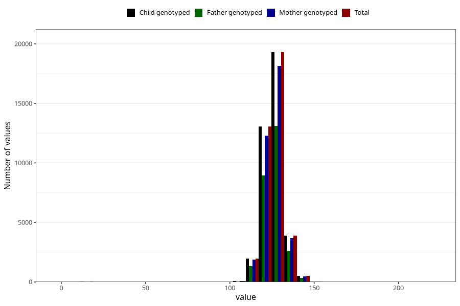

# length_7y
Variable created during phenotype curation.
- Number of values:

| Value | Total | Child genotyped | Mother genotyped | Father genotyped |
| ----- | ----- | --------------- | ---------------- | ---------------- |
| Missing | 42105 | 42105 | 39570 | 26904 |
| Non-missing | 38918 | 38918 | 36659 | 26407 |
| 25th percentile | 122 | 122 | 122 | 122 |
| 50th percentile | 126 | 126 | 126 | 126 |
| 75th percentile | 130 | 130 | 130 | 130 |
| Mean | 125.937278380184 | 125.937278380184 | 125.951608063504 | 125.898360283258 |
| Standard deviation | 6.66740946019411 | 6.66740946019411 | 6.56062465485385 | 6.49102060107235 |
| N | 38918 | 38918 | 36659 | 26407 |

