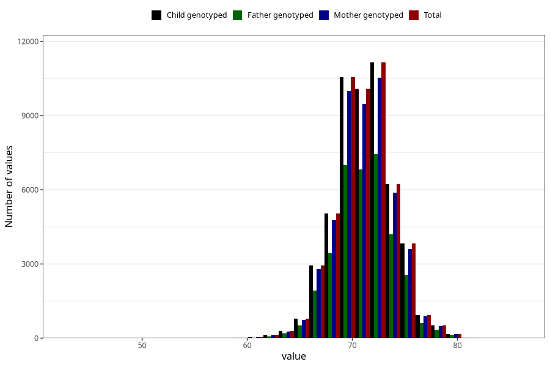

# length_8m
Variable mapping to `EE387` in `Skjema5_18mnd_v12`.
- Number of values:

| Value | Total | Child genotyped | Mother genotyped | Father genotyped |
| ----- | ----- | --------------- | ---------------- | ---------------- |
| Missing | 28262 | 28262 | 26476 | 17988 |
| Non-missing | 52761 | 52761 | 49753 | 35323 |
| 25th percentile | 69.5 | 69.5 | 69.5 | 69.5 |
| 50th percentile | 71 | 71 | 71 | 71 |
| 75th percentile | 73 | 73 | 73 | 73 |
| Mean | 71.2024298250602 | 71.2024298250602 | 71.1981026269773 | 71.2092347762081 |
| Standard deviation | 2.81459610963222 | 2.81459610963222 | 2.81155916670827 | 2.78684487859095 |
| N | 52761 | 52761 | 49753 | 35323 |

