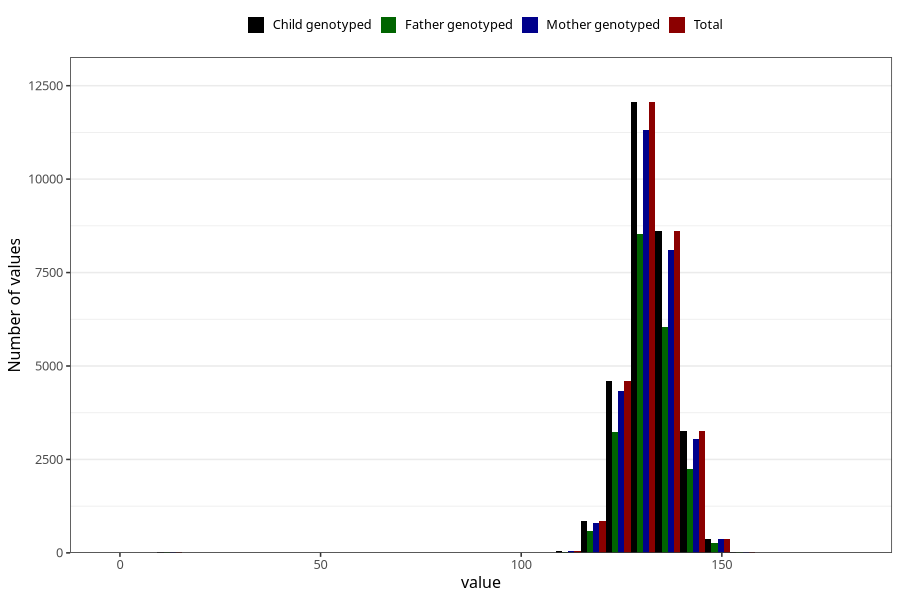

# length_8y
Variable mapping to `NN24` in `Skjema8aar_v12`.
- Number of values:

| Value | Total | Child genotyped | Mother genotyped | Father genotyped |
| ----- | ----- | --------------- | ---------------- | ---------------- |
| Missing | 51159 | 51159 | 48179 | 32352 |
| Non-missing | 29864 | 29864 | 28050 | 20959 |
| 25th percentile | 128 | 128 | 128 | 128 |
| 50th percentile | 132 | 132 | 132 | 132 |
| 75th percentile | 136 | 136 | 136 | 136 |
| Mean | 132.099316903295 | 132.099316903295 | 132.089304812834 | 132.108783816022 |
| Standard deviation | 6.60100741811122 | 6.60100741811122 | 6.6479152139866 | 6.43985279508042 |
| N | 29864 | 29864 | 28050 | 20959 |

