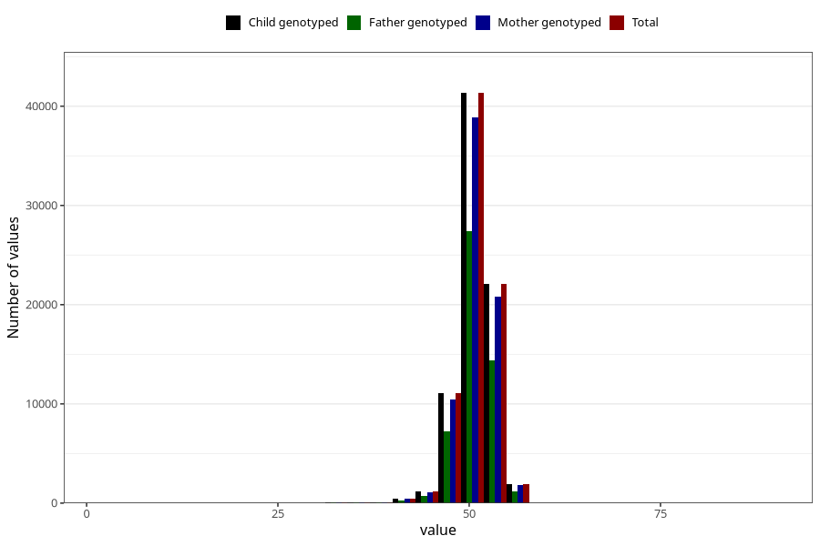

# length_birth
Variable mapping to `LENGDE` in `MFR_541_v12`.
Variable mapping to `LENGDE` in `MFR_541_v12`.
- Number of values:

| Value | Total | Child genotyped | Mother genotyped | Father genotyped |
| ----- | ----- | --------------- | ---------------- | ---------------- |
| Missing | 2738 | 2738 | 2581 | 1859 |
| Non-missing | 78285 | 78285 | 73648 | 51452 |
| 25th percentile | 49 | 49 | 49 | 49 |
| 50th percentile | 50 | 50 | 50 | 50 |
| 75th percentile | 52 | 52 | 52 | 52 |
| Mean | 50.3906750974005 | 50.3906750974005 | 50.3904926135129 | 50.3913744849569 |
| Standard deviation | 2.36967710625831 | 2.36967710625831 | 2.36955591014827 | 2.33779287868958 |
| N | 78285 | 78285 | 73648 | 51452 |

