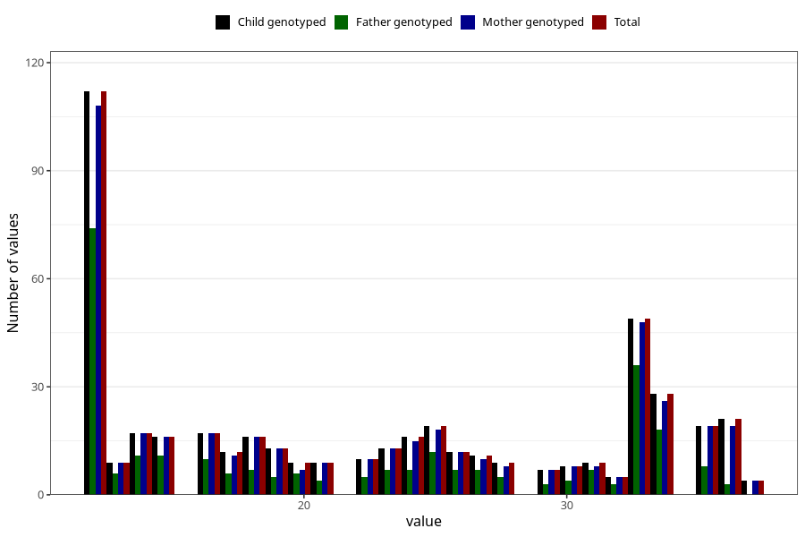

# metabolic_age_wf
Variable mapping to `WK19` in `WF_Klinikkskjema_v12`.
- Number of values:

| Value | Total | Child genotyped | Mother genotyped | Father genotyped |
| ----- | ----- | --------------- | ---------------- | ---------------- |
| Missing | 80553 | 80553 | 75776 | 53039 |
| Non-missing | 470 | 470 | 453 | 272 |
| 25th percentile | 13 | 13 | 13 | 12 |
| 50th percentile | 22 | 22 | 22 | 20.5 |
| 75th percentile | 33 | 33 | 33 | 31.25 |
| Mean | 22.5063829787234 | 22.5063829787234 | 22.439293598234 | 21.8014705882353 |
| Standard deviation | 8.80025693207298 | 8.80025693207298 | 8.79531006536497 | 8.71468189242824 |
| N | 470 | 470 | 453 | 272 |

