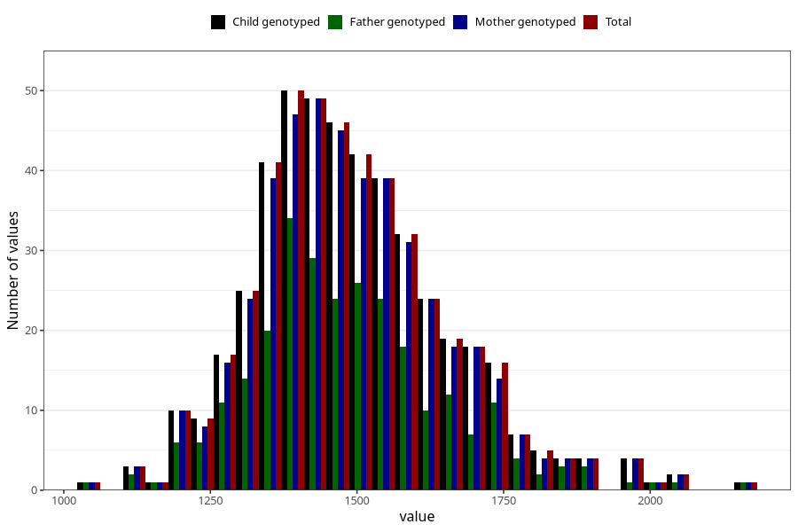

# resting_metab_wf
Variable mapping to `WK20` in `WF_Klinikkskjema_v12`.
- Number of values:

| Value | Total | Child genotyped | Mother genotyped | Father genotyped |
| ----- | ----- | --------------- | ---------------- | ---------------- |
| Missing | 80553 | 80553 | 75776 | 53039 |
| Non-missing | 470 | 470 | 453 | 272 |
| 25th percentile | 1380.25 | 1380.25 | 1381 | 1383.25 |
| 50th percentile | 1472.5 | 1472.5 | 1472 | 1464.5 |
| 75th percentile | 1580.5 | 1580.5 | 1581 | 1573.25 |
| Mean | 1492.29361702128 | 1492.29361702128 | 1492.67770419426 | 1487.38235294118 |
| Standard deviation | 165.327854678912 | 165.327854678912 | 165.274636983767 | 167.481344836504 |
| N | 470 | 470 | 453 | 272 |

